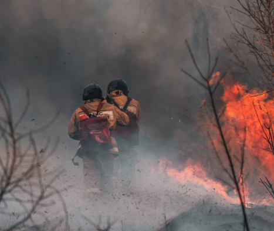

## Welcome to my Portfolio!

| Project                 | Repositories | Release date |
| ------------------------| -----------  | -----------  |
| Fire Detection 🔥| [Link](https://github.com/norbertkocon94/Fire_detection_project) | 02.2022 |
| Airline Passenger Satisfaction ✈️ | In Progress | In Progress |
| Gesture detection 🙏  | In Progress | In Progress |

# Education
* Masters of Science (Mechatronics), *University of Silesia in Katowice*, 2018-2019
* Bachelors of Science (Mechatronics), *University of Silesia in Katowice*, 2014-2017

# [Project 1: Fire Detection 🔥](https://github.com/norbertkocon94/Fire_detection_project)

This project was created to teach a fire detection model.

* **Python libraries used:** Pandas, Numpy, TensorFlow, Matplotlib, Sklearn
* **Input:** Kaggle dataset
* **Output:** Classification of photos (Fire/Non-Fire)

# Project 2: Airline Passenger Satisfaction ✈️ (In Progress . . .)

This project was created to teach a passenger satisfactio model.

* **Python libraries used:** Pandas, Numpy, Sklearn
* **Input:** Kaggle dataset
* **Output:** Classification of satisfaction (Customer Satisfaction Classification)

# Project 3: Gesture detection 🙏 (In Progress . . .)

This project was created to teach a gestures detection model.

* **Python libraries used:** Pandas, Numpy, TensorFlow, Matplotlib, Sklearn
* **Input:** Own data set
* **Output:** Classification of photos (Five popular gestures)
